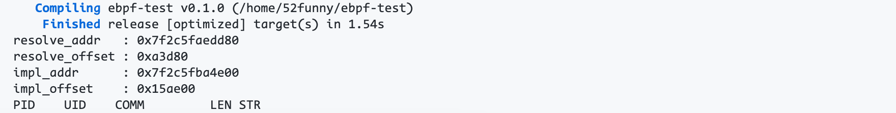
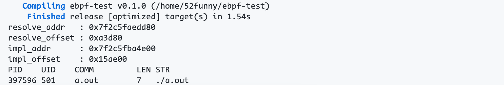

# Hook GLIBC

This is demo to hook IFUNC `strlen` in `glibc.so.6` using ebpf.

Compile ebpf program and run it.

```bash
cargo build -r && sudo ./targer/release/ebpf-hook-ifunc
```



Compile a `strlen` demo

```
gcc strlen.c
```

Then execute `strlen` demo

```
./a.out
```

ebpf program will intercept and output information


